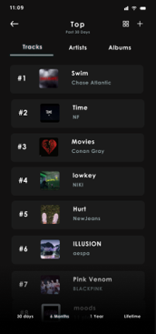

## 1. 서비스 설명

### 1.1. 추진배경

  현재 시중에 나와 있는 대부분의 음악 추천 서비스들은 청취 이력 기반 알고리즘을 사용하는 것에 기능이 국한돼 있는 편이다. 즉 다양한 추천 알고리즘을 지원하지 않는다는 말이다. 또한 소수의 그렇지 아니한 해외 추천 서비스들은 반대로 국내 음원이 부족해 한국 사용자가 사용 메리트가 떨어지는 편이다. 그렇기에 우리는 이러한 부족한 점들을 보완하기 위해 단순히 청취 이력뿐만 아니라, 장소, 날씨, 감정, 사용자 정보에 따라 음악을 추천할 수 있으며, 국내 음원을 충분히 가져 국내 사용자들의 요구를 맞출 수 있는 음악 추천 서비스를 고안하기로 하였다.

  이를 위해 기상청 단기예보 API, Geolocator API, Places API, Emotion-recognition, Elastic Search, Music Auto-Tagger, Scrapy와 같은 오픈소스 소프트웨어들을 사용할 것이다.

### 1.2. 서비스 설명

#### 1.2.1. 기본 기능

* 플레이 리스트 저장 및 좋아요 기능 
  * 우리의 서비스는 음악을 플레이리스트에 저장하거나 ‘좋아요’ 표시하는 기능을 가진다. 이를 통해 마음에 들었던 음악을 언제든지 쉽게 찾아 청취할 수 있다. 
* 차트 기능
  * 또한 멜론과 같은 기존의 서비스들이 제공하는 차트와 함께, 서비스 자체적으로 제공하는 인기차트 기능 또한 제공할 예정이다. 
* 제공된 정보 이용
  * 더불어 사용자가 동의할 경우, 직업과 나이와 같은 사용자 정보들을 이용해 사용자와 비슷한 사람들이 많이 듣는 음악을 추천해 주는 기능 또한 제공할 것이다.

#### 1.2.2. 추천 기능

* 이러한 기본적인 음악 플레이어 기능 외에도, 우리의 서비스는 다양한 방식의 추천 알고리즘을 제공하는데, 취향을 통한 추천, 위치 및 날씨를 통한 추천, 감정을 통한 추천 방식으로 나눌 수 있다. 

* 취향 추천
  * 먼저 취향을 통한 추천은 기존의 음악 추천 서비스들과 비슷하게 사용자가 좋아하는 것으로 판단된 노래들과 비슷한 노래들을 추천해 주는 방식이다. 
  * 이를 위해 먼저 가입 시, 사용자에게 취향을 물어 기초적인 사용자 취향을 파악한다. 
  * 이렇게 파악된 취향 정보와 서비스의 데이터베이스에 기록된 있는 음악들의 메타 데이터를 비교하여 적절한 음악을 추천해 주는 것이 기본적인 추천 과정이다. 
  * 이후 사용자가 서비스를 이용하면서 축적된 청취 이력을 바탕으로 주로 듣는 음악들의 메타데이터를 취합한 뒤, 이와 유사한 메타데이터를 갖는 음악을 찾아 추천해줄 수도 있다. 
  * 또한 사용자가 ‘좋아요’ 표시한 음악이나, 플레이리스트에 저장한 음악 또한 분석하여 취향 정보에 반영할 수 있다. 
  * 이러한 방식들로 유추된 취향 정보들은 유저 데이터베이스를 업데이트하는 데 쓰일 수 있으며, 이를 통해 사용자 각자에게 개인화된 서비스를 제공할 수 있게 한다. 

* 위치 추천
  * 위치를 통한 추천은 사용자 기기의 GPS의 정보를 받아와 음악을 추천하는 방식이다. 
  * 사용자가 현재 위치한 건물, 도시, 국가를 추적하고 이를 통해 데이터베이스에 수록된 음악들과 비교하여 연관성 있는 음악들을 추천해주는 것이다. 
  * 또한 해당 장소에서 많이 재생된 음악을 추천해주는 것을 통해 장소의 분위기와 맞는 음악을 추천해줄 수도 있다. 
  * 이렇게 얻은 위치 정보들은 현재 사용자가 위치하는 곳의 날씨를 알아내는 데에도 쓰인다. 날씨를 알아내어 그 날씨의 분위기와 맞는 음악을 추천해주는 것이다.

* 감정 추천
  * 감정을 통한 추천은 사용자에게 현재 감정을 물어보는 간단한 설문을 하는 방식과 사용자 휴대폰의 카메라를 이용하여 얼굴을 인식, 분석하는 방식을 사용한다. 
  * 이러한 방식들을 통해서 알아낸 감정 정보들은 사용자가 현재 원하는 음악들을 찾는 데 큰 도움이 될 수 있다. 
  * 특히 카메라를 사용한 방식은 사용자들에게 더욱 직관적일 뿐만 아니라, 그 자체로 신선한 경험이 되어 흥미 요소로 작용할 수 있다.

* 정보 추천
  * 이러한 방식들 외에도 사용자 동의하에 나이, 직업, 성별 정보를 제공받아 추천을 할 수도 있다. 
  * 앞서 말한 정보들을 이용해 사용자와 비슷한 집단들을 찾아내고, 그 집단이 주로 듣는 음악을 추천해주거나, 그 음악들의 태그를 이용해 다른 음악들을 추천해주는 방식이다.
  * 이런 방식은 비슷한 사용자가 듣는 음악을 추천해주는 것으로 사용자의 취향에 맞는 음악을 추천해줄 수 있다는 점뿐만 아니라, 사용자가 자신과 비슷한 사람도 이러한 앱을 사용한다는 일종의 소속감을 느끼도록 해 서비스에 대한 흥미를 끌어낼 수 있다는 점에서 가치가 크다.

### 1.3. 예상 GUI

- 시작 화면과 로그인창

  - 어플의 이름은 우리 어플의 핵심기능인 추천을 영어로한 'recommend'에서 're'를 따와서 **RE:MUSIC** 으로 정하였다.

   


- 메인화면

  - 메인화면에서는 사용자의 취향, 위치, 기분 그리고 현재 날씨를 추적하는 오픈소스를 통해 정보를 받아 그에 걸맞은 추천 플레이리스트를 제공한다. 

  

   

  - 사용자의 기기의 GPS 정보를 추적하는 오픈소스를 통해 사용자가 현재 카페에 있음을 알아내어 카페에서 듣기 좋은 플레이리스트("달콤 쌉사름한 커피와 함께")를 추천해주고 있다. 
  - 현재 사용자가 위치한 지역에서는 비가 내리고 있다는 정보를 오픈 API를 통해 알아내어서 비가 오는 날 듣기 좋은 플레이리스트("오늘 같이 비오는 날 듣기 좋아요")를 추천해주고 있다.
  - 사용자의 얼굴을 분석하여 사용자의 감정을 파악해주는 오픈소스를 이용하여 현재 사용자의 기분이 우울하다는 것을 파악하여 우울한 날 들을만 한 플레이스트("우울해보여요 이 노래는 어때요?")를 추천해주고 있다.
  - 평소 사용자가 좋아요한 음악들이나 자주듣는 노래를 음원,가사 분석 오픈 소스를 이용하여  사용자의 음악 취향 정보에 반영하여 이에 걸맞는 플레이 리스트(''애니메이션OST")를 추천해준다.

- 추천 받은 플레이리스트 

   


- 인기차트

  - 메인화면에서 RE:차트를 누르면 우리 서비스에서 자체적으로 제공하는 인기차트를 확인할 수 있다.

  

- 검색창

  - 검색엔진을 이용하여 원하는 음악이나 , 아티스트를 검색하면 그에 걸맞는 검색 결과를 제공해준다.

  

  

  ## 2. 유사 서비스 분석

  

  ### 2.1. 애플 뮤직(Apple Music)

  - 인공지능 Siri

    - 인공지능 Siri에게 얘기하면 원하는 아티스트의 곡을 틀어주는 건 물론, 그때그때 기분에 따라 아니면 장르에 따라 꼭 맞는 곡을 골라주기도 한다.
    - "OOO의 최신앨범을 찾아줘", "1976년 노래 중 가장 좋은 곡을 들려줘", "기분 안 좋을 때 듣는 음악 틀어줘"

  - '지금 듣기'

    - 이미 즐겨 듣는 곡들을 바탕으로 새로운 최애곡 후보들을 간편하게 발견할 수 있다.

    - 처음 탭하면 Apple Music은 사용자의 취향에 관해 묻는데 Apple Music은 이 선호도 정보를 사용하여 음악을 추천한다.

  - '둘러보기'

    - 전문 Apple Music 에디터들의 엄선된 맞춤 플레이리스트를 여러 종류로 추천받을 수 있다

      <small>ex. 겨울에 듣는 편안한 음악, 홀리데이 시즌에 듣는 R&B, 대한민국 대표 힙합 등</small>

    - 인기 신곡과 최신곡을 확인할 수 있다.

    - '오늘의 TOP 100'은 각 나라별로 사람들이 많이 듣는 음악을 추천한다.

    - 행복, 파티, 휴식, 로맨스, 슬픔, 숙면 등의 여러 무드별로 그에 맞는 음악을 추천한다. 

  - 사용자가 선호하는 노래와 유사한 노래의 플레이리스트

    - 사용자가 가장 자주 듣는 음악들을 모은 플레이리스트를 제공하고, 이를 바탕으로 세부적으로 다시 음악을 분류해 플레이리스트를 제공한다. 
    - 예를 들어 내가 듣는 음악 중에서 신나는 분위기의 플레이리스트, 차분한 분위기의 플레이리스트 등을 추천해주는 식이다. 
    - 좋아요 또는 비슷한 항목 제안하지 않기를 하면 이후 추천 음악에 반영한다.
    - 사용자가 한 음원을 선택해서 들으면 사용자의 평소 패턴 등을 고려한 알고리즘을 바탕으로 감성을 파악해 다른 음원을 추천하는 큐레이팅 서비스이다.

  - '라디오 스테이션' 기능

    - 사용자가 마음에 드는 노래와 비슷한 분위기와 장르의 노래를 계속 들을 수 있다.
    - 자신이 마음에 들었던 곡의 스테이션을 생성하면 그 곡과 비슷한 시기에 출시한 비슷한 음원들을 틀어준다.

  - For You의 '즐겨찾는 아티스트'

    - 사용자가 어떤 아티스트를 즐겨찾는 아티스트로 표시하면 For You의 '즐겨찾는 아티스트' 아래에 나타나고 해당 아티스트의 음악 추천 횟수가 늘어난다.
    - 아티스트들이 영향을 주고받은 음악들로 이루어진 플레이리스트를 볼 수 있다. 내가 좋아하는 아티스트에게 영감을 준 음악을 살펴볼 수 있다.

  ### 2.2. 멜론(Melon)

  - 마이 리플레이(My Replay)

    - 이용자가 과거 특정 시점에 많이 들은 곡을 제공한다.

    - 5년 이상 연속 이용자를 분류하는 멤버십 등급이 따로 있을 정도로 장기 고객이 많은 멜론의 강점을 살려서 이용자가 잊고 있던 한때의 명곡 을 반갑게 돌이켜 줄 수 있다.

  - '내가 감상한 음악'

    - 최근 들은 곡, 좋아요한 음악, 많이 들은 음악, 최근 들은 DJ플레이리스트, 최근 들은 플레이리스트, 최근 감상한 영상, 최근 들은 스테이션, 팬 맺은 아티스트 채널 등을 이용자의 감상이력에 맞춰 노출한다.

  - '최근 관심 곡과 비슷한'

    - 이용자가 최근 관심을 보인 곡 또는 여러 번 감상한 곡을 기반으로 유사곡 믹스를 제공 , 연간 63만곡이 국내 음악시장에 발매중인 가운데 이용자가 미처 몰랐던 자신의 취향 저격 곡을 발견하는 재미를 선사한다.

  - '상황별 맞춤 음악'

    - 일상에서 자주 만나는 상황을 태그로 정리하여 음악을 추천,  '휴식', '출퇴근', '운동', '드라이브' 등의 태그를 누르면 각 상황에 딱 어울리는 음악들을 손쉽게 감상이 가능하다.

  - For U

    > 빅데이터 기반으로 개인 취향에 맞춰 음악 추천해주는 기능

    - 예를 들어 '카페에 앉아, 트렌디한 감성의 힙합을 듣고 싶어요' 등으로 듣고 싶은 음악의 상황에 맞게 추천을 받을 수 있다.
    - 셀프 디제잉 메뉴를 통해 본인이 좋아하는 음악 감상 가능 , 개인화 설정을 통해 선곡 모드, 선호 장르 반영 정도, 선호 아티스트 반영 정도를 선곡 결과에 반영 가능하다.
    - For U 메인 화면에서는 투데이 픽, 선호 장르 등으로 구성된 인기곡을 추천 받을 수 있다.
    - 빅데이터 기반으로 내 취향에 맞는 음악을 추천 받을 수 있기 때문에 내가 좋아하는 취향의 새로운 곡들을 만나고, 잊고 있던 곡들을 다시 만나는 재미를 즐길 수 있다.

  - 모두의 명곡 믹스

    - 뉴트로(New-tro) 열풍에 맞추어 MZ세대가 '시간 여행'을 마음껏 즐길 수 있는 믹스이다.

    - 이용자가 특정 연도에 발매된 곡을 다수 감상하면 생겨나며, 1980년부터 현재까지 정리되어 있는 멜론의 국내외 시대별 차트를 활용하여 해당 연도의 인기 곡을 전반적으로 감상해볼 수 있다. 
    - 빅데이터 기반으로 내 취향에 맞는 음악을 추천 받을 수 있기 때문에 내가 좋아하는 취향의 새로운 곡들을 만나고, 잊고 있던 곡들을 다시 만나는 재미를 즐길 수 있다.

  - 멜론 라디오 맞춤 채널, 맞춤 플레이 리스트

    > 뮤직 DNA, 마이로그 등을 바탕으로 음악을 라디오 처럼 들려주는 기능

    - 맞춤 라디오 버튼만 누리면 내 취향을 바탕으로 음악들이 연속으로 플레이된다.
    - 마이로그에 들어가면 내가 멜론 서비스를 어떻게 사용했는지를 확인할 수 있으며, 뮤직 DNA를 누르면 내가 어떤 장르의 음악들을 주로 감상했는지 그리고 선호 아티스트는 누구인지 확인 가능하다. 이러한 뮤직 DNA를 바탕으로 음악을 들려준다.
    - 내가 최근 들었던 곡 리스트를 바탕으로 플레이 리스트를 만들어서 감상할 수도 있다.

  - 멜론 DJ

    > 음악 전문가와 멜론 이용자 DJ들이 엄선한 다양한 장르의 플레이리스트들의 본인의 취향에 맞춰 선택을 해서 감상할 수 있는 기능

    - 메인 메뉴에서 멜론 DJ 메뉴를 선택하게 되면 추천태그, 인기DJ, 선호 장르 플레이스트 등을 만날 수 있다.
    - 내가 음악을 선곡하는 것이 아니라 전문가와 이용자들에게 좋은 평가를 받고 있는 스타DJ들이 들려주는 플레이리스트들을 통해서 다양한 주제로 음악들을 만나볼 수 있다.

  - 스마트 i

    > 음성 인식 서비스, 베타서비스를 제공, 멜론이 보유하고 있는 음악 빅데이터와 카카오의 음성인식 기술이 결합된 서비스

    - "아이유 인기곡 들려줘", "90년대 댄스곡 재생", "내가 좋아요 한 노래 들려줘"
    - 한 곡을 들려주는 것이 아니라 연속으로 들려주기 때문에 편리하게 감상할 수 있다.

  ### 2.3. 바이브(VIBE)

  - 자동 추천 재생

    > 바로 이전에 재생한 곡들을 바탕으로 유사한 곡을 계속해서 추천하는 기능이다

    - 예를 들어 특정 '믹스테잎'의 곡을 모두 들었을 때 이어서 비슷한 곡을 들려주거나, 사용자가 지금 듣고 싶은 스타일의 곡을 몇 개 골라 들으면 굳이 다음 노래를 고르지 않아도 알아서 같은 스타일의 곡을 재생한다.
    - 딥러닝 기술 적용
      - 바이브 사용자들의 청취 데이터를 학습한 딥러닝 모델이 사용자가 방금까지 들었던 곡의 스타일을 분석(개별 음원의 특성 추출, 사용자가 좋아할 만한 곡까지 예측)하여 다음 곡을 추천한다.
      - 개인의 음악 감상 패턴을 바탕으로 선호 장르와 아티스트를 파악하고, 협력 필터링 모델을 활용해 비슷한 취향의 사용자 그룹이 많이 소비한 음악을 추천한다.
      - 콘텐츠 기반 필터링의 학습 범위를 세밀화해 추천 정확도를 높였으며 아티스트를 객관적인 장르로 해석하여 아티스트 간 유사도를 고려하여 AI를 학습시킨다.

  - 기존 협업 기반 필터링과 내용 기반 추천을 합친 하이브리드 추천 시스템

    > 사용자가 전에 재생한 음악과 같은 음악을 재생한 다른 사용자들의 행동, 그리고 음악의 악기, 장르 등 개별적인 속성을 통합적으로 고려한 기술

    - 협업 필터링 기반 추천

      - 사용자의 음악 감상 패턴을 바탕으로 비슷한 취향의 사용자 그룹이 많이 소비한 음악을 추천해주는 방식이다.
      - 음향적 특징보다 인기 곡을 중심으로 추천이 되며, 감상 이력이 없는 신곡을 추천해주기 어렵다는 문제점이 있다.

    - 내용 기반 추천

      - 인기도에 관계없이 장르, 무드, 악기 등 개별 음원의 특성을 추출해 이를 바탕으로 사용자가 좋아할 만한 곡을 예측하는 방식이다.

      - 오디오 기반 추천에서 특정 장르, 무드를 분류하기 어려운 모호성 문제점이 있다.

        <small>ex. 퀸의 ‘보헤미안 랩소디’ 같은 경우 사람마다 다른 기준으로 장르를 파악</small>

      - 사람이 직접 음악의 장르적 특징, 무드 등을 레이블링을 해야 한다는 문제점이 있다.

      - 아티스트 레이블(곡 출시와 함께 자동으로 생성되는 객관적인 정보)을 사용하는 방식으로 문제를 해결하는 연구를 진행하여 아티스트를 하나의 작은 장르로 해석하는 방식으로 기존 내용 기반 추천의 한계를 해결하고 아티스트끼리 유사도를 학습하는 방식을 더해 출력 레이어가 과도하게 증가하는 문제도 해소했다.

  - 실제 추천 방식

    - 자주 들었던 곡의 아티스트의 다른 곡, 계절에 따라 잘 어울리는 노래, 시기에 따른 음악, 시간대에 따른 음악 등

  ### 2.4. 지니(genie)

  - 음악 분류 알고리즘

    - 곡에 장르, 분위기, 가수 등의 정보로 여러 태그를 붙이고, 직접 수많은 플레이리스트를 작성하여 사용자에게 추천한다.

  - '뮤직 컬러' 서비스

    - 사용자가 즐겨 듣는 음악을 색으로 분류 및 추천, 많이 들을수록 색이 진해진다.
    - 지니뮤직에 있는 모든 음악을 333가지 컬러로 매칭하고 사용자들의 음악 감성 및 취향을 컬러로 표현하고 사용자마다 표현된 컬러에 해당하는 컬러의 음악을 추천해준다. 
    - 뮤직컬러는 사용자가 매일 어떤 음악을 듣느냐에 따라 달라질 수 있으며 자신만의 뮤직캘린더에 기록되기 때문에 자신의 음악 감성이 매일 어떻게 달라지는지 확인할 수 있다.

  - '뮤직 허그' 서비스

    - 아날로그 감성을 살린 일반인 DJ의 추천 서비스로 이용자들은 DJ와 실시간으로 채팅을 하며 DJ가 선곡해 추천하는 음악을 감상할 수 있다.

  - '그때 당신이 즐겨 듣던' 서비스

    - 이용자 본인이 지난해 이맘때 들었던 음악을 다시 들을 수 있도록 한다.

  - 다양한 플레이리스트

    - 시간, 장소, 하는 운동(달리기, 등산, 운전 등)에 따라 플레이리스트가 제공되며 사용자가 선택한다.

  - 큐레이션 서비스 'For You'

    - 타임 큐레이션

      - 시간의 흐름에 따라 고객의 라이프스타일을 반영한 음악큐레이션으로 새벽, 아침, 점심, 저녁 시간대에 어울리는 다양한 음악플레이스트를 30곡씩 랜덤하게 24시간 제공한다.

        <small>ex. 느긋한 오후를 즐기고 싶은 사람에게는 '#오후', '#음악충전', '한박자', '쉬어가자' 등의 해시태그와 함께 30개의 곡을 제공</small>

      - 기존에 즐겨 듣던 음악에서 벗어나 새로운 음악스타일을 접하고 싶은 고객들을 위해 탄생됐다.

    - 취향 확장형 큐레이션

      - 고객의 음악 감상 이력과 패턴 등이 세밀하게 분석해 제공된다.

      - '좋아할 것 같은 스타일'코너는 평소 고객이 즐겨 듣는 음악과 유사한 곡을 제시한다.

        > 유사곡을 추출하는 큐레이션은 인공지능(AI)의 머신러닝을 통한 기계적인 유사도에 전문가의 핑거프린트 무드 데이터(곡마다 분위기를 갖도록 기술적으로 처리한 것)를 분석해 맞춤형 조합 데이터를 잘 구성하는 것이 핵심이다.

      - '나와 닮은 사람들은'코너는 평소 나와 비슷한 음악취향을 가진 사람들이 즐겨 듣는 음악을 소개한다.

        > 아티스트나 장르 등 자주 듣는 곡 자체의 메타데이터를 비롯해 선호 데이터, 감상 패턴, 감상 횟수, 감상한 곡의 수 등 다양한 기준을 적용해 개인의 감상 패턴을 세부적으로 분석한다.
        >
        > 이러한 분석을 토대로 음악감상 유형이 비슷하게 나온 사람들을 한 그룹으로 묶는다. 이후 같은 그룹에 묶인 사람들이 감상한 음악들을 기반으로 개인의 음악 성향을 점수화해 분류하는 '스코어링 필터링' 작업을 진행한다.

      - 고객이 선호 장르, 아티스트, 작곡가를 기반으로 한 플레이리스트, 지난달 많이 들은 곡을 들으며 자연스럽게 자신의 음악감상영역을 넓혀나길 수 있도록 구성한다.

      - 사용자가 감상한 음악 이력을 히스토리화해 분석하고 개인별 원천 데이터셋을 구성한 후 원천 데이터셋이 구성되면 선호하는 작곡가나 아티스트, 1년 전에 들은 곡 등 다양한 조건에 맞게 추천한다.


## 3. 시스템 설계

### 3.1. 전체 시스템 구조


#### 3.1.1. 전체 시스템 다이어그램


#### 3.1.2. 데이터 베이스 및 데이터 모델

- 계정 DB : 아이디 비밀번호 등의 사용자의 개인 정보와 선호도 등의 정보를 저장하는 DB
- 음원 정보 DB : 음원 태그 데이터와 음원 정보(가사, 아티스트)를 저장하는 DB
- 음원 파일 DB : mp3,flac등 음원 파일 자체를 저장하는 DB
- 학습데이터 DB : 기계학습을 위한 학습 데이터를 저장하는 DB

#### 3.1.3. 파트별 설명 및 기능

- **Flutter 애플리케이션(사용자)** 
  - 사용자의 디바이스에서 동작하는 사용자와 통신하기 위한 애플리케이션
  - 앱 제작 오픈소스 프레임워크인 **Flutter**로 제작

- **음악 검색 및 추천 시스템**
  - **Flutter 애플리케이션**으로 부터 음악 추천 요청을 받아 다시 **앱**으로 추천 음악 데이터를 전송
- **음악 태그 데이터 학습**
  - 다양한 방법으로 데이터를 수집해 기계학습을 통해 음악(muid)을 키로하는 태그 데이터를 생성하고 **음악 검색 및 추천 시스템**으로 갱신된 데이터를 전송
- **계정 정보 관리**
  - 로그인, 회원가입, 프로필 데이터 관리등 일반적인 계정 정보와 좋아요 등의 프로필 정보를 관리하고 **앱**과 계정과 관련된 통신을 담당


### 3.2. 상세 설계

#### 3.2.1. 음악 검색 및 추천

- **음악 검색 및 추천 시스템**은 **Flutter 애플리케이션**으로 부터 음악 추천 요청을 받아 음원 정보 DB에서 태그 기반으로 검색해 결과를 다시 **앱**으로 전송한다.

##### DFD

- 

- 날씨에 따른 음악 추천, 장소에 따른 음악 추천등의 모든 음악 추천 요청은 **애플리케이션 음악 요청**으로 표현

- **음원 정보 DB**에서 검색 : **음악 검색 API**에서 태그를 포함한 음악 요청을 받아 태그를 기반으로 음악을 검색하여 muid를 포함한 음원 정보 데이터 객체의 리스트를 **음악 검색 API**에 돌려줌

- **음악 검색 API**에서 추천한 음악 추천 리스트는 추천 재생목록등의 기능에 쓰이기 위해 **애플리케이션**으로 이동하고, 음악 스트리밍시에 muid를 **음원 요청 API**에 입력해 **음원 파일 DB**로 부터 음원 파일을 다운로드

  

##### 	API 설명 및 입출력

- **오픈소스** 

  - Geolocator
    - 기능 : Flutter 프레임 워크 안에서 디바이스의 GPS 서비스와 통신하는 라이브러리
    - 입력 : 좌표 요청(Flutter 에서 함수 호출)
    - 출력 : 좌표(위도 경도)
  - 기상청 단기 예보 중 초단기 실황 정보
    - 기능 : 예보 구역에 대한 대표 AWS 관측값 제공. 현재 날씨 데이터를 받아오기 위해 초단기 예보 사용
    - 입력 : 좌표를 포함한 초단기 예보 요청 객체
    - 출력 : 날씨 데이터 객체
  - Emotion - recognition 
    - 기능 : 사진이나 영상을 분석해 사진 속 인물의 복합적인 감정의 비율을 출력
    - 입력 : 사진
    - 출력 : 감정과 그 확률을 쌍으로 하는 배열
  - Elastic Search
    - 기능 : 오타 수정, 동의어 처리, 데이터 집계 및 분석등 자연어로 이루어진 검색어 처리를 위한 다양한 기능 제공
    - 입력 : 검색어
    - 출력 : 검색어 분석 결과
  - Places API
    - 기능 : 구글 맵 플랫폼으로 여러 입력을 장소로 변환하는 기능을 포함해 특정 장소에 대한 정보, 관련된 검색어 자동완성, 추천 기능등 지역 및 장소에 대한 다양한 기능을 제공. 여기서는 좌표를 장소 유형과 세부 정보를 가져오는 기능을 사용
      - 좌표를 통해 국가, 지역, 건물, 장소, 장소 유형등의 정보를 얻어 **음악 검색 및 추천 서버**로 전송함
    - 입력 : 좌표
    - 출력 : 시설, 시리적 위치 및 주요 관심 장소에 대한 정보

- **자체 개발 API**

  - 날씨 통신 API

    - 기능 : **애플리케이션**의 요청에 따라 **Geolocator**에서 좌표를 요청하고 이를 바탕으로 요청 객체를 제작하고 **기상청 단기예보 API**에 초단기 실황을 요청함. 또한 받은 날씨 데이터를 **음악 검색 및 추천 서버**으로 전송
    - 입력 : 좌표
    - 출력 : 좌표를 포함한 초단기예보 요청 객체

  - 음악 검색 API

    - 기능 : **애플리케이션**의 다양한 음악 추천 및 검색 요청을 정리하고 음악 데이터를 **애플리케이션**에 다시 전송
      - 감정 해석 텍스트, 검색어 분석 결과, 날씨, 장소 등 다양한 형태의 요청 데이터를 **음악 태그 데이터 DB**의 데이터를 태그 기반으로 검색하기 위해 일정한 **검색 객체**로 변환함
    - 음악 검색
      - 입력 : 감정 해석 텍스트, 검색어 분석 결과, 좌표 , 국가, 장소, 날씨 등 다양한 요청 정보
      - 출력 : 태그를 포함한 일정한 검색 객체
    - 음악 데이터 전송 : **음악 데이터 DB**로 부터 받은 데이터를 요청한 사용자 **애플리케이션**에 전송

  - 음원 요청 API

    - 기능 : 음원 파일을  **음원 DB**에 요청하고 **사용자 디바이스**에 스트리밍을 위해 다운로드
    - 입력 : muid
    - 출력 : 음원 파일(flac , mp3 등)

    

#### 3.2.2. 음악 데이터 제작 및 학습 

##### **DFD**


- **기계 학습 데이터 생성 API**는 여러 API를 통해 얻은 데이터 출력을 통일시키고 학습 데이터 DB에 축적시킨다. 축적된 데이터는 **기계 학습 클라우드 서버에** 전송되어 학습을 진행하고, 완료된 데이터는 **음원정보 DB**로 전달되어 태그 정보를 업데이트시킨다.
- 콜드 스타트 : 신규 혹은 사용한지 얼마 되지 않은 정보가 부족한 사용자에게 어떤 컨텐츠를 추천할 것인지에 대한 문제
  - 회원 가입시 나이, 성별 등의 기본 정보 입력을 통해 기본적인 정보를 얻어 사용자 정보 기반 추천에 사용한다. 그 후 로그인을 한 후, 사용자와 비슷한 특징을 가진 모집단의 추천을 통하여 음악을 제공한다. 사용자의 현재 위치한 장소나 날씨를 기반으로, 또는 연령과 성별 등의 개인 정보로 나뉘는 모집단이 즐겨 듣는 노래가 있는지, 판단하는 것이다. 
  - 서비스에서 최초 회원 정보와 장소, 감정을 통한 추천이 이루어지므로, 콜드스타트로부터 비교적 자유로울 수 있다.
  - 크롤링을 이용한 외부 데이터 학습과 music auto tagger를 통한 음원 자체 분석이 이루어 지므로 사용자 데이터 축적 없이 음악을 추천 할 수 있다


##### **API 설명 및 입출력**

- **오픈소스**
  - Scrapy

    - 기능 : 여러 사이트의 인기차트 목록, 음악의 인터넷 상 검색 기록, 평가 등의 정보 수집

    - 입력 : 사이트의 URL

    - 출력 : 차트 리스트, 관련 검색된 단어 

    - 지니, 벅스 등의 음원 스트리밍 서비스 외에도 국내의 노래방 인기차트, 해외의 빌보드 등 여러 차트 정보의 URL을 통해 인기차트 목록을 추출한다. 여러 음악 평론이나 가수, 작곡가 등의 정보 또한 수집한다.
  - music auto tagger

    - 기능 : 곡의 주파수 데시벨 등을 분석하여 알맞는 장르의 태깅

    - 입력 : 음원 파일 ( .mp3 )
    - 출력 : 분류된 장르와 그 확률값을 나타내는 실수 벡터
    - 장르, 가사, 반주에 사용되는 악기, 곡의 주파수와 데시벨 등을 분석하여 특징을 찾아내고, 관련된 장르와 그에 가까운 값을 실수와 함께 나타내어 출력한다. 

- **자체 개발 API**
  - 기계 학습 데이터 생성 API
    - 기능 : 입력 받은 데이터 정리 및 **학습 DB**에 전달
    - 입력 : 리스트, 음원 벡터
    - 출력 : 학습 데이터

 

#### 3.2.3. 계정 관리

##### **DFD**

![image-20221201172517038]./image/계정 파트.png)

- 계정 DB는 사용자 디바이스로 추천되는 음악과 선호도를 저장하고, 학습 서버에 선호도를 전달한다. 

##### **API 설명 및 입출력**

- **자체 제작 API**
  - 계정 API
    - 기능 : 서비스의 서버와 계정 DB간 통신 및 회원 관리
      - 최초 사용자의 회원가입, 로그인, 개인의 선호도 등이 포함된 **계정 DB**와 **애플리케이션**의 통신 등
    - 입력 : 사용자 정보 요청
    - 출력 : 사용자 정보 반환


## 4. 오픈소스

### 4.1 사용 오픈소스 

#### 4.1.1. 앱 제작 프레임 워크: Flutter

(https://github.com/flutter/flutter/blob/master/LICENSE)
구글에서 제작한 하이브리드 앱 제작용 오픈소스 프레임워크. 설계한 애플리케이션의 프론트엔드 개발에서 사용함.
iOS, Android, 웹, Windows, MacOS, Linux의 여섯 가지 플랫폼에 대한 애플리케이션 개발을 지원. 프로그래밍 언어로 Dart를 사용하고 기계 코드로 컴파일함.

* 빠른 성능 : 호스트 디바이스가 코드를 이해하므로 빠르고 효과적인 성능이 보장.
* 빠르고 일관적이며 사용자를 지정할 수 있는 렌더링 : Flutter는 플랫폼별 렌더링 도구를 사용하지 않고, Google의 오픈 소스 Skia 그래픽 라이브러리를 사용하여 UI를 렌더링. 따라서 애플리케이션에 액세스하는 데 사용하는 플랫폼에 관계없이 사용자에게 일관된 시각적 경험을 제공. 
* 개발자에게 편리한 도구 : 개발자는 도구(핫 리로드)를 사용하여 상태를 바꾸지 않고 코드 변경 내용을 미리 확인 가능. 또한 위젯 검사기를 사용하면 UI 레이아웃 문제를 손쉽게 시각화하고 해결 가능.

* 입력 데이터 : 모든 데이터가 입력값으로 통과함.
* 출력 데이터 : 거의 모든 데이터가 사용자의 디바이스에 출력됨.

* 라이선스 : BSD 3-Clause "New" or "Revised" License

>* BSD 2-Clause "New" or "Revised" License : BSD 2-Clause 와 유사하나 허락 없이 앱을 홍보하는데에 저작권자나 기여자의 이름을 사용하는것을 금지
>* BSD 2-Clause : 재배포시 저작권 표시, 준수조건 및 보증부인에 대한 고지사항을 소스코드 또는 문서 및 기타자료에 포함시켜야 함.


#### 4.1.2. 날씨 API: 기상청 단기예보

(https://www.data.go.kr/data/15084084/openapi.do)
초단기실황, 초단기예보, 단기((구)동네)예보, 예보버전 정보를 조회하는 서비스. 

* 초단기실황정보 : 예보 구역에 대한 대표 AWS 관측값 제공.
* 초단기예보 : 예보시점부터 6시간까지의 예보 제공. 
* 단기예보 : 예보기간을 글피까지 확장 및 예보단위를 상세화(3시간→1시간)하여 시공간적으로 세분화한 예보를 제공. 
  이러한 정보를 조회하기 위해 발표일자, 발표시각, 예보지점 X 좌표, 예보지점 Y 좌표의 조회 조건으로 자료구분코드, 실황값, 발표일자, 발표시각, 예보지점 X 좌표, 예보지점 Y 좌표의 정보를 조회.

* 입력 데이터 : 사용자의 위치 좌표값
* 출력 데이터 : 입력한 좌표에 따른 장소의 날씨

* 라이선스 : CC License(CC BY)

> * CC License : 저작자가 일정한 조건하에 자신의 저작물을 다른 사람들이 자유롭게 이용할 수 있도록 허락하는 라이선스
> * 저작자 표시(CC BY) (Attribution) : 저작자의 이름, 출처 등 저작자를 반드시 표시해야 한다는 필수 조건. 저작물을 복사하거나 다른 곳에 게시할 때도 반드시 저작자와 출처를 표시해야 함.


#### 4.1.3. 디바이스 위치 API: Geolocator

(https://pub.dev/packages/geolocator)
Flutter용 geolocation 플러그인으로, 플랫폼의 location 서비스에 접근이 쉽게 가능하도록 도와줌. 안드로이드 또는 IOS의 플랫폼을 사용. 

* 마지막으로 알려진 위치를 가져옴.
* 장치의 현재 위치를 가져옴.
* 지속적으로 위치를 업데이트 받음.
* 두 지리좌표 사이의 거리를 계산.
* 두 지리좌표 사이의 방위를 계산.


* 입력 : 함수 호출
* 출력 : 위도 경도를 포함, Position 객체를 출력.

* 라이선스 : MIT

> * MIT License : 미국 매사추세츠 공과대학교(MIT)에서 해당 대학의 소프트웨어 공학도들을 돕기 위해 개발한 라이선스. MIT 라이선스를 따르는 소프트웨어를 개조한 제품을 반드시 오픈 소스로 배포해야 한다는 규정이 없으며 GNU 일반 공중 라이선스의 엄격함을 피하려는 사용자들에게 인기.


#### 4.1.4. 위치 데이터 API: Places API

(https://developers.google.com/maps/documentation/places/web-service)
구글 맵 플랫폼으로 여러 입력을 장소로 변환. 그 외로 특정 장소의 자세한 정보와 사진, 검색 자동완성 기능, 검색어 추천 기능을 제공. 좌표값을 받은 후 장소로 변환하고 특정 장소의 자세한 정보와 사진, 검색 자동완성 기능, 검색어 추천기능을 제공. 약 2억 곳 이상의 장소에 대한 위치 데이터를 가져오고 앱에 장소 세부정보, 검색, 자동 완성을 추가할 수 있음.

* 장소 검색 : 시설, 주요 관심 장소, 지리적 위치에 대한 장소 정보를 검색.
* 장소 세부정보 : 특정 시설 또는 관심 장소에 대한 세부정보를 가져옴.
* 장소 ID : 특정 장소에 대한 세부정보를 가져오고, 특정 장소의 ID를 찾고, 장소 ID를 저장하고 새로고침하는 방법에 대해 탐색 가능.
* Place Autocomplete : 애플리케이션에 예상 검색어 자동 완성 기능을 추가. (장소 이름, 주소 또는 플러스 코드로 검색)
* 쿼리 자동완성 : 애플리케이션에 즉석 지역 예상 검색어를 추가. (텍스트 쿼리로 검색).
* 장소 유형 : 장소 유형을 사용하여 장소 검색 및 자동 완성 요청의 결과를 제한.
* 장소 아이콘 : 다양한 유형의 장소에 대한 요청 및 표시 아이콘

* 입력 : 좌표
* 출력 : 시설, 지리적 위치 또는 주요 관심 장소

* 라이선스 : Apache 2.0 License

> * Apache 2.0 License : 아파치 재단(Apache Software Foundation)에서 관리하는 모든 오픈 소스 소프트웨어(아파치 웹 서버 등)에 적용되는 라이선스. 오픈 소스를 그대로 재배포하거나 수정하여 재배포하더라도 소스 코드를 공개할 의무가 없으며 상업적 이용에도 제한을 두고 있지 않음. 다만, 재배포하는 경우 아파치 라이선스 2.0 복사본 제공, 아파치에 의해 개발되었음에 대한 저작권 표시, 보증 책임이 없음 등에 대한 표시를 의무.

#### 4.1.5. 감정 API : Emotion-recognition

* 사람의 얼굴 이미지나 영상을 분석하여 기분이 어떠한지 뿐만 아니라 그 사람이 가질 수 있는 혼합된 감정의 확률을 보여줌

* 입력값: 사람의 얼굴이 포함된 사진이나 동영상

* 출력값: angry, disgust, scared, happy, sad, surprised, neutral 감정의 비율

* MIT 라이선스
  * Copyright (c) [2018] [Omar Ayman]


#### 4.1.6. 검색 엔진 : elastic search

Apache Lucence 기반의 Full-text 엔진

특징: Near Real-time인덱싱 + ELK 스택 연동성

사용 가능 기능

* 질의어 자동 완성(auto completion)
* 오타 수정(correcting typos)
* 일치 항목 강조 표시(highlighting matches)
* 동의어 처리(handling synoms)
* Relevance 조정(adjusting relevance)
* 데이터 집계 및 분석(aggregate & analyze data)

ES 사용 예

* 데이터 집합 분석(aggregation analysis) 및 ML기술을 이용한 데이터 예측(forecast)
* 이상치 파악(anomaly derection)을 통한 실시간 모니터링 및 알림

ES 사용 이유

* 뛰어난 Full-text search
* 텍스트 변형(유의어, 동의어)를 통한 검색 가능
* 비정형 데이터 분석, 처리 가능
* 형태소 분석을 통한 자연어 처리 가능
* Inverted list를 이용한 빠른 검색 기능

Elastic Search

**Search**

* 검색 질의에 대한 답변

데이터가 유입 될 때 indexing이라는 프로세스를 진행하여 검색 및 통계를 위한 Document를 확보함.

검색어를 추출하기 위한 프로세스인 Analysis는 캐릭터 필터(Character Filter) - 토크나이저(Tokenizer) - 토큰 필터(Token Filter)로 구성, 순차적 실행

* 캐릭터 필터 - 불필요한 데이터의 삭제, 변경 등 입력된 원본 데이터를 분석에 필요한 형태로 변환
* 토크나이저 - 검색의 기초 데이터로 사용하기 위해 필요로 하는 키워드 데이터로 분리
* 토큰 필터 - 토크나이저 작업 시 발생한 불필요한 데이터를 삭제하거나, 영문인 경우 모두 소문자로 변경하는 등 중요 데이터만 남기고 분석 작업을 종료

**Observability**

머신 데이터를 기반으로 데이터 생명 주기 관점에서 시각화를 통해 기능을 수행함

* Logs - 로그 데이터를 머신에서 이벤트가 발생할 때마다 생성되는 데이터로 받아들임
* Mertric - 머신이 일정 주기로 측정하여 만든 측정 데이터로 이해하여 받아들임
* APM - Logs와 Metric을 통해 받아들인 데이터를 종합, 추척하여 운영 중인 애플리케이션의 성능 분석을 용이하게함

키바나 애플리케이션(데이터 시각화 도구)

(디스커버, 비주얼라이즈, 대시보드로 구성)

* 디스커버 - 원본 도큐먼트를 검색하거나 필터링 할 수 있는 도구
  * 수집한 데이터의 정형화된 모습과 필요 데이터 검색, 필드를 구성하는 데이터의 간단한 통계 수치 확인 가능
* 비주얼라이즈 - 축적된 데이터를 막대그래프, 파이 차트, 타일 맵, 지도 등 다양한 형식으로 시각화 하여 보여줌
* 대시보드 - 비주얼라이즈를 통해 시각화한 객체를 모아 하나의 화면에서 확인할 수 있도록 함

**Security**

보안 정보와 이벤트 관리 솔루션을 키바나(데이터 시각화 도구)에 탑재하여 외부의 시스템 공격이나 이상 징후를 선제적으로 방어하고 조치함

엘라스틱 설치를 통해 전송되는 데이터를 허가되지 않은 사용자의 접근과 의도치 않은 수정으로부터 가장 먼저 구현 => 인증 절차

**도입 시 고려사항**

기업 여건에 맞는 서브스크립션 선택

* 엘라스틱서치는 Search, Observability, Security를 위한 다양한 소프트웨어를 갖추고 잇으며 기본 기능은 무료로 사용할 수 있는 **베이직 서브스크립션** 을 제공함

전문 기술서비스 활용

* 가상머신(JVM)에서 구동함. JVM Heap 메모리 등의 자원 사용률이 높은 통계 집계 질의와 인덱싱은 시스템에 부담을 주어 장애를 발생시킬 수 있다. - 인덱스 설계 최적화 중요

업그레이드 시 임의 수정 코드 반영 확인

**ElasticSearch 라이선싱**

Elasticsearch와 Kibana의 Apache 2.0 라이선스 소스 코드를 Elastic License 및 SSPL 1.0에 따라 이중 라이선스로 전환하여 사용자가 어느 라이선스를 적용할 지 선택할 수 있도록 변경하고 있다.

 Elastic License(Elastic License v2 또는 ELv2)를 단순화하고 훨씬 더 허용 범위가 커지도록 하고 있다. 기본 배포판은 거의 지난 3년 동안 그랬던 것처럼 계속 Elastic License를 따르게 되며, 더 이상 Apache 2.0 배포는 생산되지 않는다.

Elastic License 2.0은 Elasticsearch와 Kibana의 모든 무료 및 유료 기능의 소스 코드와 Elastic의 배포에 적용된다. ELv2를 이용하는 우리의 목표는 남용으로부터 보호하면서 가능한 한 많은 것을 허용하는 것입니다. 이 라이선스는 다음의 세 가지 간단한 제한 사항과 함께 사용, 수정, 파생 작품 생성 및 재배포를 할 수 있는 자유로운 권리를 허용함.

* 제품을 다른 사람에게 관리형 서비스로 제공 X
* 라이선스 키 기능을 우회하거나 라이선스 키로 보호되는 기능을 제거하면/숨길 수 없다.
* 라이선스, 저작권 또는 기타 통지를 제거하거나 숨길 수 없다.

Elastic Search 흐름

Ex) Elastic Search 내부 DFD

App => 이벤트 =>pipeline=>ES(내부 변환)=>pipeline => metrics index(머신이 일정 주기로 측정하여 만든 측정 데이터로 이해하여 받아들이는 것) => 변환 후 내보냄

user =(검색어 벡터)> => 위의 설명처럼 내부 처리 후 => (검색어 벡터) 내보냄

API를 통해 es사용 시 Apache 2.0으로 라이센스ㅅ가 부여됨.


#### 4.1.7. 음원 분석 : music auto tagger 

  * CNN 혹은 합성곱 신경망 사용함

    * 뇌의 동작. 그 중에서도 시각 피질조직의 구성에서 영감을 받은 방식
    * 수용장이 점점 더 커질 수록 점점 더 복잡한 시각 자극에 반응하는 방식에서 착안
    * 신경망의 계층이 깊어질 수록 입력의 더 자세한 특성을 분석하게 됨

  * 음악을 분석할 시 음악의 주파수를 이용함

    * 정확히는 음원을 멜 스펙트로그램으로 변환하여 분석하는 것 
    * 이 경우 파이썬의 librosa 라이브러리를 사용해 멜 스펙트로그램 얻을 수 있음
    * 이 오픈소스의 경우에도 data 디렉토리 내의 음악을 librosa 라이브러리를 이용해 변환해 분석.

  * 음악을 분석하여 음악의 특성에 가까운 태그에 실수값 점수를 부여함

    * ```
      예) [('jazz', '0.444'), ('instrumental', '0.151'), ('folk', '0.103'), ('Hip-Hop', '0.103'), ('ambient', '0.077')]
      [('guitar', '0.068'), ('rock', '0.058'), ('acoustic', '0.054'), ('experimental', '0.051'), ('electronic', '0.042')]
      ```

    * 불잍수 있는 태그는 다음과 같음

      * ['rock', 'pop', 'alternative', 'indie', 'electronic', 'female vocalists', 
        'dance', '00s', 'alternative rock', 'jazz', 'beautiful', 'metal', 
        'chillout', 'male vocalists', 'classic rock', 'soul', 'indie rock',
        'Mellow', 'electronica', '80s', 'folk', '90s', 'chill', 'instrumental',
        'punk', 'oldies', 'blues', 'hard rock', 'ambient', 'acoustic', 'experimental',
        'female vocalist', 'guitar', 'Hip-Hop', '70s', 'party', 'country', 'easy listening',
        'sexy', 'catchy', 'funk', 'electro' ,'heavy metal', 'Progressive rock',
        '60s', 'rnb', 'indie pop', 'sad', 'House', 'happy']

  * 데이터 흐름

    * 입력 : 음원 파일(mp3)
    * 음악을 librosa 라이브러리 통해 멜스펙토그램으로 변환
    * 특징 추출 알고리즘을 통해 음악적 특징 추출
    * 추출된 특징 이용해 음악에 적절한 태그를 찾고, 그 태그에 얼마나 걸맞는지 실수값 점수 매김
    * 출력 : [('jazz', '0.444'), ('instrumental', '0.151'), ('folk', '0.103'), ('Hip-Hop', '0.103'), ('ambient', '0.077')]
      [('guitar', '0.068'), ('rock', '0.058'), ('acoustic', '0.054'), ('experimental', '0.051'), ('electronic', '0.042')]

  * MIT 라이선스

    * Copyright (c) 2016 최근우

#### 4.1.8.크롤링: scrapy 

- Scraping을 도와주기 위한 파이썬 기반 라이브러리 
- 크롤링을 할 URL을 입력받아 원하는 데이터를 추출함.

- 입력: 원하는 데이터가 담긴 웹페이지의 url
- 출력: 웹페이지 데이터(텍스트)


BSD라이선스

다음 조건을 충족하는 경우 허용됩니다.

1. 소스 코드의 재배포는 위의 저작권 표시를 유지해야합니다

   이 조건 목록 및 다음 면책 조항

2. 바이너라 형태의 재배포는 위의 저작권을 복제해야합니다.

   통지, 이 조건 목록 및 다음 면책 조항은

   배포와 함께 제공된 설명서 및/또는 기타 자료.

3. Scarpy의 이름이나 기여자의 이름을 사용할 수 없습니다.


## 4.2. 오픈소스 라이센스

> 최종 라이센스 계열: BSD

### 4.2.1. MIT 라이선스

- 저작권 안내문구, MIT 라이선스 문구가 모든 복제본에 포함

- 이 소프트웨어 및 관련 문서 파일("소프트웨어")의 사본을 얻는 모든 사람에게 사용, 복사, 수정, 병합 권한을 포함하여 제한 없이 소프트웨어를 제한 없이 처리할 수 있는 권한이 무료로 부여됩니다. , 소프트웨어 사본을 게시, 배포, 서브라이선스 및/또는 판매하고 소프트웨어를 제공받은 사람이 그렇게 할 수 있도록 다음 조건에 따라 허용합니다.

  위의 저작권 표시 및 이 허가 표시는 소프트웨어의 모든 사본 또는 상당 부분에 포함되어야 합니다.

  소프트웨어는 상품성, 특정 목적에의 적합성 및 비침해성에 대한 보증을 포함하되 이에 국한되지 않고 명시적이든 묵시적이든 어떠한 종류의 보증 없이 "있는 그대로" 제공됩니다. 어떤 경우에도 작성자나 저작권 보유자는 소프트웨어 또는 소프트웨어의 사용 또는 기타 거래로 인해 또는 이와 관련하여 발생하는 계약, 불법 행위 또는 기타 행위에 관계없이 청구, 손해 또는 기타 책임에 대해 책임을 지지 않습니다. 소프트웨어.

### 4.2.2. Apache 2.0

* 라이센서에게 Contribution 하는 경우 Apache 라이선스를 따름

* 수취인에게 라이선스 사본 제공
* 수정된 파일에 대해 수정사항을 표시한 안내문구 첨부
* 저작권, 특허, 상표, attribution에 대한 고지사항을 소스코드 또는 "NOTICE" 파일 등에 포함
* 최초개발자 등을 위해 보증을 면제하고, 책임을 제한

### 4.2.3. BSD 라이선스

* 재배포시 저작권 표시, 준수 조건 및 보증부인에 대한 고지사항을 소스코드 또는 문서 및 기타 자료에 포함
* 최초개발자나 기여자의 이름을 제품에 대한 보증이나 홍보에 사용하지 못함

### 4.2.4. CC License(CC BY)

*  저작자 및 출처만 표시한다면, 제한없이 자유롭게 이용할 수 있음
